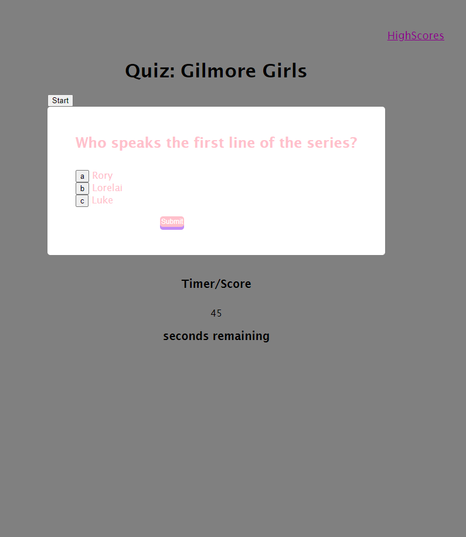
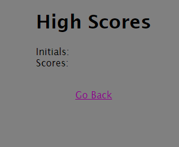

# QuizTime

## Your Task

Create a quiz regarding a topic of choice that maintains high scores Create a simple calendar application that allows a user to save events for each hour of the day by modifying starter code. This app will run in the browser and feature dynamically updated HTML and CSS powered by jQuery.

You'll need to use the [Moment.js](https://momentjs.com/) library to work with date and time. Be sure to read the documentation carefully and concentrate on using Moment.js in the browser.

## User Story

AS A coding boot camp student
I WANT to take a timed quiz on JavaScript fundamentals that stores high scores
SO THAT I can gauge my progress compared to my peers

## Acceptance Criteria

* GIVEN I am taking a code quiz

* WHEN I click the start button

* THEN a timer starts and I am presented with a question

* WHEN I answer a question

* THEN I am presented with another question

* WHEN I answer a question incorrectly

* THEN time is subtracted from the clock

* WHEN all questions are answered or the timer reaches 0

* THEN the game is over

* WHEN the game is over

* THEN I can save my initials and score

##  Link to Site

[Deguzman Link](https://trianad.github.io/QuizTime/)

## Site View

Quiz page view
 
High scores page view

